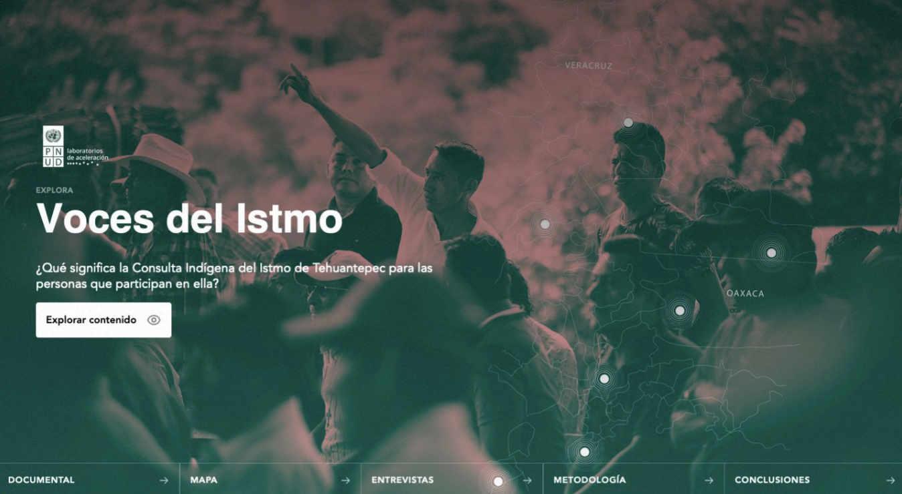

## Micrositio "Voces del Istmo" - PNUD CDMX (2020)

<h1 align="center"> Micrositio índice de voces del Istmo</h1>

 

## Tabla de Contenidos
- [Descripción y Contexto](#descripción-y-contexto)
- [Guía de Instalación](#guía-de-instalación)
- [Autor/es](#autores)
- [Información Adicional](#información-adicional)
- [Licencia](#licencia)
- [Limitación de Responsabilidades (Solo BID)](#limitación-de-responsabilidades-solo-bid)

## Descripción y Contexto
Este repositorio contiene el código fuente del micrositio, Voces del Istmo. Este proyecto busca destacar voces y experiencias de las comunidades del Istmo de Tehuantepec en México, a través de un sistema online e interactivo.

## Guía de Instalación
A continuación se presenta una guía detallada para la instalación y ejecución del micrositio de Voces del Itsmo del PNUD.

1. Requisitos Previos
Antes de comenzar con la instalación, asegúrate de tener instalados los siguientes requisitos:

Node.js (versión 12 o superior)
npm (Node Package Manager) o Yarn
    
    # Clonar repositorio de manera local:
    git clone https://github.com/tu_usuario/tu_repositorio.git
    cd tu_repositorio

    # Instala las dependencias necesarias para el proyecto. Puedes usar npm o Yarn:
    $ yarn install

    # Hostear en localhost:3000
    $ yarn dev

    # Cuando estés listo para construir el proyecto para producción, ejecuta el siguiente comando:
    $ yarn build

    # Para iniciar el servidor de producción, utiliza:
    $ yarn start

    # Generar Proyecto Estático
    $ yarn generate

## Autor/es
Este micrositio fue desarrollado por: Servicios de apoyo de diseño y programación de soluciones tecnológicas, ciencia de datos y análisis y visualización de datos para el Laboratorio de Aceleración del PNUD en México (AccLab)

## Información Adicional
Visita [la web de acclab](https://www.undp.org/acceleratorlabs) para obtener más información sobre el Laboratorio de Aceleración PNUD México y sus proyectos.

## Licencia
Este proyecto está bajo la siguiente licencia: [Nombre de la Licencia]. Ver el archivo LICENSE.md para más detalles.

## Limitación de Responsabilidades
El UNDP no será responsable, bajo circunstancia alguna, de daño ni indemnización, moral o patrimonial; directo o indirecto; accesorio o especial; o por vía de consecuencia, previsto o imprevisto, que pudiese surgir:

i. Bajo cualquier teoría de responsabilidad, ya sea por contrato, infracción de derechos de propiedad intelectual, negligencia o bajo cualquier otra teoría; y/o

ii. A raíz del uso de la Herramienta Digital, incluyendo, pero sin limitación de potenciales defectos en la Herramienta Digital, o la pérdida o inexactitud de los datos de cualquier tipo. Lo anterior incluye los gastos o daños asociados a fallas de comunicación y/o fallas de funcionamiento de computadoras, vinculados con la utilización de la Herramienta Digital.